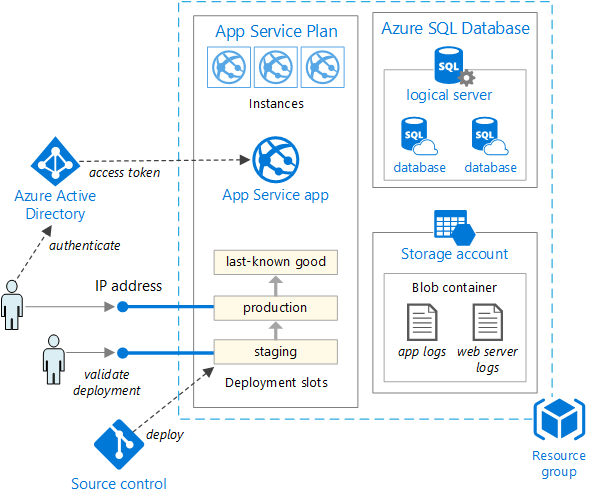

# Test odporności klastra (self-healing)

Aby przeprowadzić test odporności klastra Docker Swarm:

1. Upewnij się, że klaster i aplikacja są uruchomione.
2. W katalogu głównym projektu uruchom w PowerShell:
   ```
   powershell -ExecutionPolicy Bypass -File tests/test-resilience.ps1 -Worker worker1
   ```
   Możesz podać inny worker, np. worker2.

Skrypt automatycznie zrestartuje wskazany węzeł i sprawdzi, czy Swarm utrzymuje działanie usług (self-healing).

[](https://classroom.github.com/open-in-codespaces?assignment_repo_id=21942647)
# DevOps Swarm

1. Uruchomienie infrastruktury: `vagrant up`
1. Skrypt przygotowuje klaster Docker Swarm składający się z węzłów:

   - manager - zarządzający
   - worker1 - roboczy

   Manager jest węzłem domyślnym, więc można się z nim połączyć poleceniem `vagrant ssh`.
2. W konfiguracji zastosowano obraz `bento\debian12`. Jest on dostępny w wersjach na procesory AMD64 i ARM64 i ma zainstalowane dodatki VirtualBox. Możecie zmienić obraz na dowolny inny, który Wam pasuje. 
3. Skrypt instaluje aplikację *Portainer Community Edition* do zarządzania klastrem.
   - Hasło dla użytkownika **admin1234567** znajduje się w pliku `portainer-password.txt`.
   - Aplikacja działa pod adresem: `https://192.168.56.200:9443/`.
   - Szyfrowanie SSL jest realizowane przez certyfikat *self-signed*, więc w przeglądarce musicie zaakceptować wyjątek.
   - Po zalogowaniu się poczekajcie chwilę, aż w oknie *Quick Setup* pojawi się lokalny klaster (*Get Started*).

---
  
# Projekt: Kino

Autorzy:
- Maciej Puchalski
- Jakub Marcin Andrzejewski 

# Cel projektu

Uruchomienie aplikacji trójwarstwowej (Frontend \+ Backend \+ Baza Danych) w klastrze Docker Swarm.

# Założenia projektu

# Aplikacja

 Aplikacja do rezerwacji miejsc w kinie Okino.
 Należy stworzyć plik w application/scripts/docker-stack/secrets/db_password.txt z hasłem do bazy "postgres", plik dla **docker secrets**

# Przygotowana architektura

Opis



Tak wyglądała przygotowana konfiguracja

# Instrukcja odpalania projektu

1. **Stwórz folder z sekretami dla bazy danych:**
   - Utwórz folder `application/scripts/docker-stack/secrets` (jeśli nie istnieje).
   - Utwórz plik `db_password.txt` w tym folderze i wpisz w nim hasło do bazy (`postgres`).

2. **Uruchom maszyny wirtualne:**
   - W katalogu głównym projektu uruchom:
     ```
     vagrant up
     ```

3. **Połącz się z managerem:**
   - W katalogu głównym projektu:
     ```
     vagrant ssh manager
     ```

4. **Zbuduj i wypchnij obrazy do lokalnego rejestru:**
   - W katalogu `/vagrant/application/scripts` na managerze:
     ```
     ./build.sh
     ```

5. **Zainstaluj stack w Swarmie:**
   - W katalogu `/vagrant/application/scripts` na managerze:
     ```
     ./deploy-stack.sh
     ```

# Test rolling restart (frontend – cache i aktualizacja CSS)

W ramach testu rolling restartu oraz poprawności wdrażania nowej wersji frontendu przeprowadzono następujące kroki:

## Zbudowanie nowego obrazu
```bash
./build.sh
```

## Wdrożenie stosu
```bash
./deploy-stack.sh
```

## Zmiana stylu w aplikacji frontendowej
Zmieniono kolor nagłówka w pliku CSS:
```css
header-left h1 {
      margin: 0;
      color: #ff00dd;
      font-size: 3rem;
}
```

## Aktualizacja usługi w Docker Swarm (rolling update)
```bash
docker service update \
   --image 192.168.56.200:5000/cinema-frontend:latest \
   cinema_frontend
```

## Weryfikacja działania

Aplikacja działa poprawnie podczas aktualizacji (brak przerwy w dostępności).
Po klikaniu w aplikacji frontend działa poprawnie.
Po odświeżeniu strony widoczna jest zmiana koloru logo/nagłówka.

# Refleksje i wnioski

- Czego dowiedzieliście się z projektu.
- Co nowego was zaskoczyło.
- Z czym mieliście problemy (większe i mniejsze) - każdy w zespole musi coś napisać i oznaczyć to swoimi inicjałami.

Problemy:

**1. Przy pushowaniu obrazów do lokalnego registry pojawiał się błąd, bo Docker próbował łączyć się przez HTTPS, a nasze registry działa tylko na HTTP.**
Efekt: komunikat błędu: "server gave HTTP response to HTTPS client" i brak możliwości wypchnięcia obrazów.
- Rozwiązaniem było dodanie pliku /etc/docker/daemon.json z wpisem:
{
  "insecure-registries": ["192.168.56.200:5000"]
}
Po restarcie Dockera push zaczął działać normalnie.

- W nastepnym etapie zapomnieliśmy że również należy dodać to dla każdego worekra, inaczej docker-stack nie wystartuje bo worker nie może pobrać obrazu z managera.

**2. Przy próbie vagrant up, Musiałem ustawić "config.vbguest.auto_update = false"**
- W przeciwieństwie do lokalnego środowiska kolegi, musiałem ustawić tą property aby vagrant wstał bez błedów.

**3.Restart aplikacji/blokujący firewall do dockerhub?**
- Przy długim działaniu maszyn(manager i worker) chcąc zbudować build.sh maszyna nie miała mozliwośći połączenia się z dockerhub aby pobrać obrazy bazowe dla artefaktów, musiałem od nowa postawić środowisko.

**4. Nie działały zmienne .env dla deploy-stack.sh**
- deploy nie działal mimo wczytania zmiennych ręcznie(stack nie pobiera z automatu zmienych jak docker compose). W związk z czym dodałem "sed -i 's/\r$//' .env" aby zastąpić nowe linie z windowsa na linuxa

**5. Brak obłusgi docker secrets dla spring backend**
- Należałoby zmodyfikowąć specjalnie kod backendu aby property które podajemy przez docker secrets(plik) było wczytywane do property **SPRING_DATASOURCE_PASSWORD**. W przypadku bazy danych, property nie mają z tym problemu bo przyjmują tekst albo plik, stąd w postgresql zamiana tego była plug&play. 

**6. vagrant up wysypywał się na managerze**
- okazało się ze mirror podmieniony nie istnieje i sypało startowanie workerów. więc zakomentowałem wstawienie customowego linku do mirrora debiana.

**7. Cache-owanie plików css**
- Kiedy zmieniliśmy coś w pliku CSS, to nie od razu było widać zmiany na stronie - musieliśmy odświeżyć stronę w celu zauważenia zmian, bo przeglądarka trzymała stary plik w pamięci.

## Etap 4.1 JENKINS
**1. brak dobrej dokumentacji dla jenkins as code**
Zdecydowanym brakiem jest brak dokładnej dokumentacji pluginów dla "jenkins as code". Podczas configu tworzenia "cloud" w GUI nie dało się wyklikać aby agent posiadał volumen od controllera, okazuje się że da się do zrobić z poziomu kodu, ale wyczytałem w dokumentacji javowej paczki że należy użyć "mounts" jako string bo volumeny są "deprecated". AI kompletnie nie ogarniało tematu, ani Gemini najnowsze, ani chatgpt....  

**2. Mounty agenta z skryptami musza byc nie readonly**
skrypty przekazywane w mountach musza byc nie readonly, w przeciwnym razie sypię że "nie może wykonywać execs w danym środowisku".

**3. Jenkins wystawiony na porcie 8080**
Z racji że backend wystawiamy na tym samym porcie co jenkins trzeba było dodatkowo mapować porty backendu i frontedu(przy okazji)
